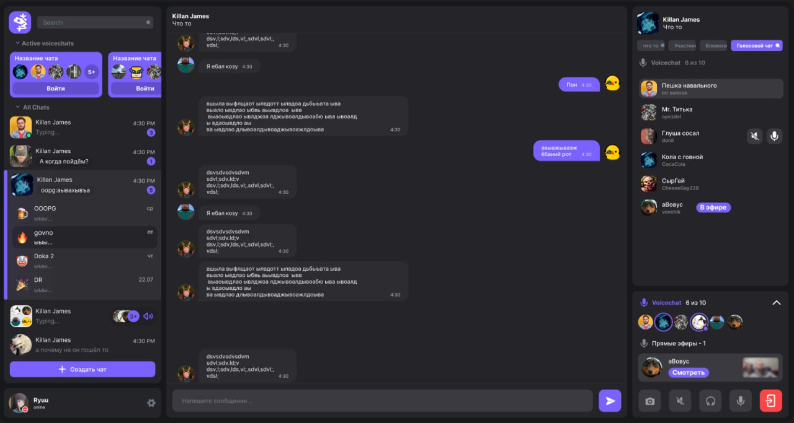
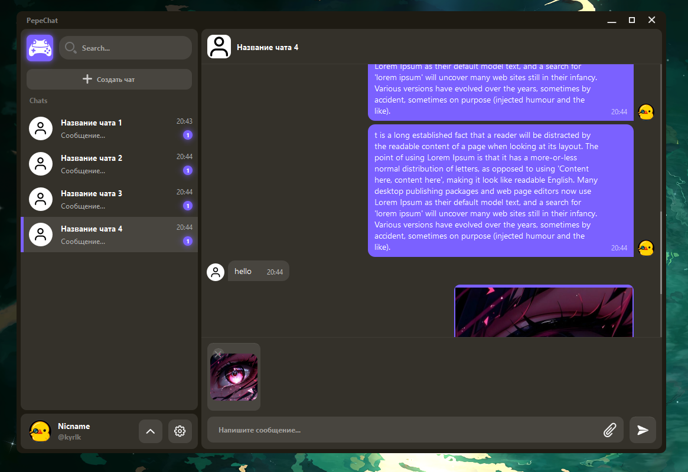

# PepeChat
**PepeChat** — это мессенджер, который сочетает в себе лучшие черты Discord и Telegram.

**Дата начала разработки:** 12 июня 2024 года

### Инновации:

- **Чат:** с более удобным интерфейсом чем в Discord
- **Звонки:** более качественные, чем в Telegram

- **Страница с популярными открытыми чатами:** уникальная функция, отсутствующая в Discord
- **Главная страница:** предлагает удобный поиск каналов по различным фильтрам

**Стэк:** Python, PyQt6, Django

---

**PepeChat** is a messenger that combines the best features of Discord and Telegram.

**Development start date:** June 12, 2024

### Innovations:

- **Chat:** with a more user-friendly interface than Discord
- **Calls:** better quality than in Telegram

- **Page with popular open chats:** a unique feature not available in Discord
- **Home page:** offers easy channel search by various filters

**Stack:** Python, PyQt6, Django

---
### Дизайн (Design) 
</img>

### Текущая стадия разработки интерфейса (Current stage of interface development) 
</img>
