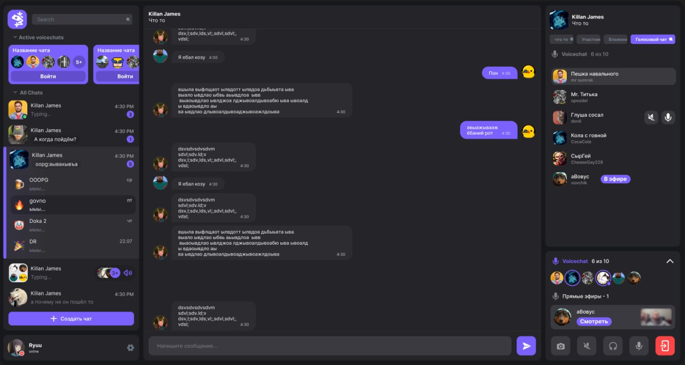
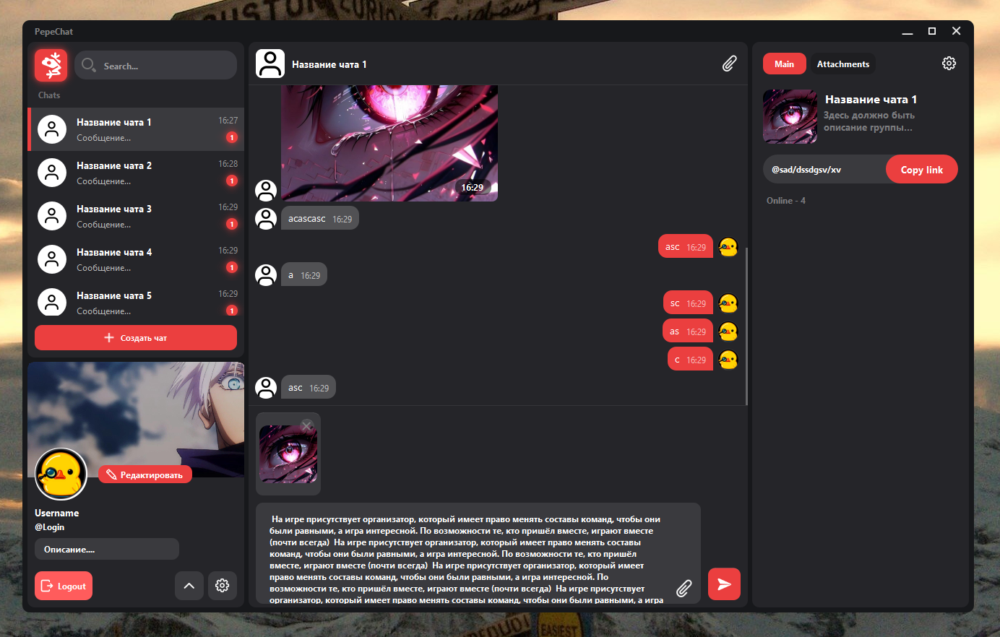

# PepeChat

**PepeChat** — это современный мессенджер, который сочетает в себе лучшие черты Discord и Telegram с акцентом удобство использования.

**Дата начала разработки:** 12 июня 2024 года

### Ключевые особенности:

- **💬 Умный чат** — интерфейс, превосходящий Discord по эргономике
- **🌐 Публичные чаты** — функция просмотра популярных открытых чатов
- **🔍 Умный поиск** — расширенная система фильтрации и поиска каналов

### Технологический стек:

**Frontend (Tauri + React):**

- **Tauri 2** — кроссплатформенный фреймворк для десктопных приложений
- **React 19** — современный UI-фреймворк
- **React Router v7** — навигация и роутинг
- **MobX 6** — управление состоянием приложения
- **Axios** — HTTP-клиент с интерцепторами
- **Vite** — быстрая сборка и dev-сервер
- **WebRTC** — технология для голосовых звонков

**Backend:**

- **Django** — мощный Python-фреймворк
- **WebSocket** — реальное время для чатов и звонков
- **Django REST Framework** — API для мобильного и веб-клиентов

**Desktop:**

- **Rust** — нативная производительность через Tauri
- **window-vibrancy** — современные визуальные эффекты

---

**PepeChat** is a modern messenger combining the best features of Discord and Telegram with a focus on communication quality and user experience.

**Development start date:** June 12, 2024

### Key Features:

- **💬 Smart Chat** — interface surpassing Discord in ergonomics
- **🎙️ Voice Calls** — high-quality communication powered by WebRTC with mesh network architecture
- **🌐 Public Chats** — unique feature for browsing popular open chats
- **🔍 Smart Search** — advanced filtering and channel discovery system

### Technology Stack:

**Frontend (Tauri + React):**

- **Tauri 2** — cross-platform desktop application framework
- **React 19** — modern UI framework
- **React Router v7** — navigation and routing
- **MobX 6** — application state management
- **Axios** — HTTP client with interceptors
- **Vite** — fast build tool and dev server
- **WebRTC** — voice calling technology

**Backend:**

- **Django** — powerful Python framework
- **WebSocket** — real-time communication for chats and calls
- **Django REST Framework** — API for mobile and web clients

**Desktop:**

- **Rust** — native performance through Tauri
- **window-vibrancy** — modern visual effects

---

### Дизайн (Design)

</img>

### Текущая стадия разработки интерфейса (Current stage of interface development)

</img>

### Структура проекта (Project Structure)

```
PepeChat/
├── tauri-app/                    # Tauri + React frontend
│   ├── src/
│   │   ├── api/                  # API клиенты и WebSocket соединения
│   │   │   ├── index.jsx         # Axios конфигурация с интерцепторами
│   │   │   └── voiceRoomSocket.js # WebSocket для голосовых комнат
│   │   ├── components/           # React компоненты
│   │   │   ├── chat/             # Компоненты чатов и голосовых комнат
│   │   │   ├── message/          # Компоненты сообщений
│   │   │   ├── auth/             # Компоненты аутентификации
│   │   │   └── UI/               # Переиспользуемые UI компоненты
│   │   ├── hooks/                # Кастомные React хуки
│   │   │   ├── useWebRTC.js      # Логика WebRTC соединений
│   │   │   ├── useVoiceRoom.js   # Управление голосовыми комнатами
│   │   │   └── useMedia.jsx      # Работа с медиаустройствами
│   │   ├── store/                # MobX хранилища
│   │   │   ├── authStore.jsx     # Состояние аутентификации
│   │   │   ├── chatStore.jsx     # Состояние чатов
│   │   │   └── messagesStore.jsx # Состояние сообщений
│   │   ├── services/             # Сервисы для работы с API
│   │   │   ├── AuthService.jsx
│   │   │   ├── ChatService.jsx
│   │   │   ├── MessageService.jsx
│   │   │   └── UserService.jsx
│   │   ├── App.jsx               # Корневой компонент
│   │   └── main.jsx              # Точка входа
│   ├── src-tauri/                # Tauri backend на Rust
│   │   ├── src/                  # Rust исходный код
│   │   ├── Cargo.toml            # Rust зависимости
│   │   └── tauri.conf.json       # Tauri конфигурация
│   └── package.json              # Node.js зависимости
├── v1/                           # Legacy версия (Python + PyQt6)
└── screenshot/                   # Скриншоты интерфейса
```

### Быстрый старт (Quick Start)

```bash
# Установка зависимостей
cd tauri-app
npm install

# Запуск в режиме разработки
npm run tauri dev

# Сборка релизной версии
npm run tauri build
```

### Лицензия (License)

Проект находится в разработке. Все права защищены.
