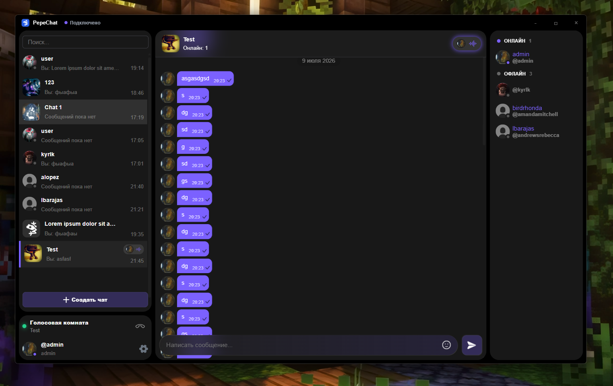

# PepeChat Client

Клиент PepeChat на React 19, Vite 7 и Tauri 2. Один код интерфейса используется для браузерного и desktop-варианта приложения.

## Требования

Для web-разработки:

- Node.js 20 или новее;
- npm;
- запущенный PepeChat API.

Для desktop-разработки дополнительно нужны Rust toolchain и системные зависимости Tauri 2 для целевой ОС.

## Установка

```bash
npm install
```

## Переменные окружения

Создайте или измените `.env.development`:

```dotenv
VITE_API_URL=http://127.0.0.1:8000
VITE_WS_URL=ws://127.0.0.1:8000
```

Доступные параметры:

| Переменная              | Назначение                                                                       |
| ----------------------- | -------------------------------------------------------------------------------- |
| `VITE_API_URL`          | Базовый адрес REST API                                                           |
| `VITE_WS_URL`           | Базовый адрес WebSocket                                                          |
| `VITE_ICE_SERVERS_JSON` | Необязательный JSON-массив `RTCIceServer[]` или объект `{ "iceServers": [...] }` |

## Команды

### Web

```bash
# Dev-сервер на http://127.0.0.1:1420
npm run dev

# Production-сборка в dist/
npm run build

# Локальный просмотр production-сборки
npm run preview
```

### Desktop

```bash
# Tauri dev
npm run tauri dev

# Установщик/desktop bundle
npm run tauri build
```

Версия приложения задаётся только в `src-tauri/Cargo.toml`. Если поле `version` отсутствует в
`src-tauri/tauri.conf.json`, Tauri автоматически использует версию Cargo-пакета. `latest.json`
создаётся во время подписанной release-сборки, поэтому менять его версию вручную не нужно.
Updater получает подписанный манифест и артефакты из GitHub Releases.

## Структура

```text
frontend/
├── public/                     # Статические изображения, иконки и audio worklet
├── src/
│   ├── api/                    # Axios и WebSocket-клиенты
│   ├── components/             # React UI
│   ├── config/                 # Переменные окружения
│   ├── hooks/                  # WebRTC, voice room и audio hooks
│   ├── notifications/          # Toast-уведомления
│   ├── services/               # REST, media и локальный кэш
│   ├── store/                  # MobX stores
│   ├── style/                  # Глобальные стили
│   ├── updates/                # Tauri updater provider
│   ├── utils/                  # Ошибки, media URL и вспомогательные данные
│   ├── App.jsx                 # Маршруты и восстановление сессии
│   └── main.jsx                # Providers и инициализация stores
├── src-tauri/                  # Rust/Tauri backend, capabilities и icons
├── screenshot/                # Скриншоты проекта
├── ARCHITECTURE.md             # Подробности voice/WebRTC архитектуры
├── package.json
└── vite.config.js
```

## Скриншот


